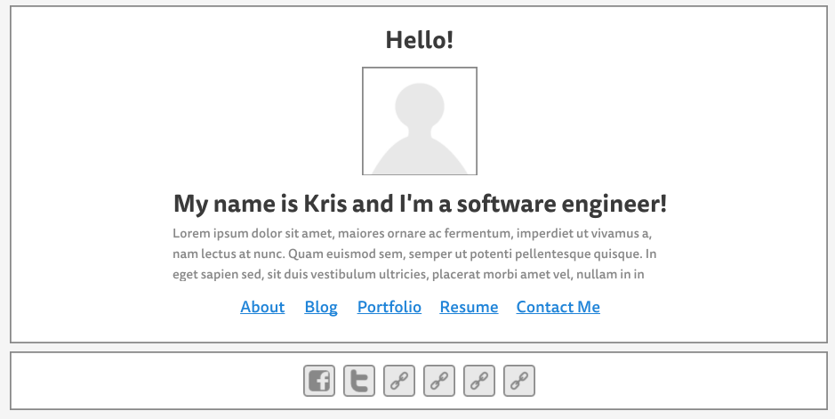
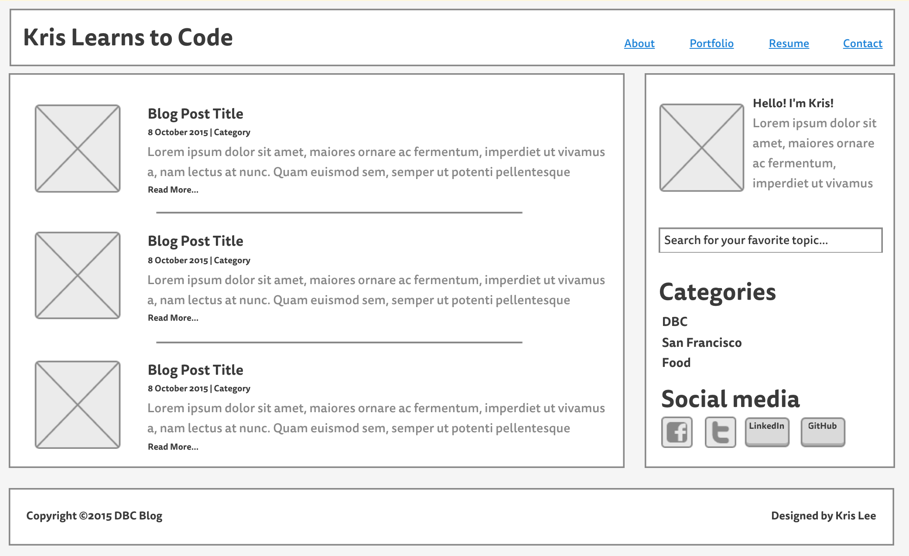

#2.4 Wireframing

**Wireframe for the site index:**

**Wireframe for the blog index:**

**1. What is a wireframe?**

A wireframe is a visual guide that represents the skeletal framework of a website. It's sort of a blueprint for how you want your website to look like, basically figuring out the layout for the website, where sections and elements will be located.

**2. What are the benefits of wireframing?**

Wireframing is really useful because it's akin to having a plan before you actually develop a website. It allows to have an idea of how you want a site to look quickly, figure out design elements and navigation without actually coding yet. It makes the actual website development easier since you already have a guide of how the site should look.

**3. Did you enjoy wireframing your site?**

Yes I did although I feel like I still don't really know an effective design so it was pretty tough for me to come up with a design that I feel totally happy with.

**4. Did you revise your wireframe or stick with your first idea?**

I ended up revising my wireframe a couple of times, taking into consideration some of the things I learned when reading about good wireframe designs.

**5. What questions did you ask during this challenge? What resources did you find to help you answer them?**

What makes a good site design? What elements should I be including and what is the ideal location for each? To answer these questions, I visited other websites to see how they implemented various things. I took note of elements that I thought were most effective.

**6. Which parts of the challenge did you enjoy and which parts did you find tedious?**

To be honest, I found coming up with the design a bit tedious, I felt like I spent too much time rethinking the design because I was so unsure of the ones I am coming up with. I feel like the actual designing part is not my strong point. I will probably enjoy trying to implement the designs rather than actually designing something.